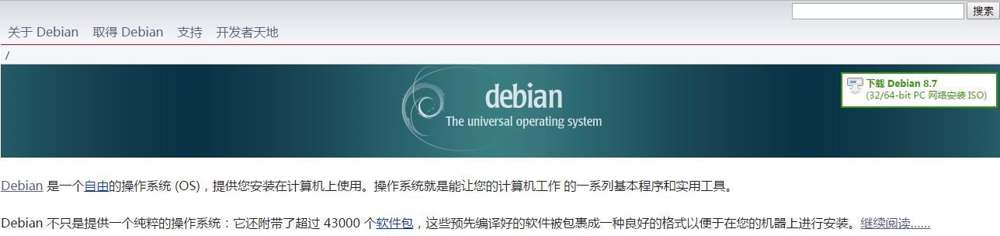

## 安装操作系统

### debian简介

我们选用的debian网址首页如下图

我们选用debian的原因：

1.软件包管理

Debian中的软件包由dpkg和apt-get来管理。如今，它们管理依赖项的能力不再很独特；几个对应工具(比如dnf和urpmi)有一两个选项是dpkg和apt-get所没有的。然而，它们仍是一大批用来查看和处理软件包的实用工具的核心。没有对应工具提供那么多的选项来解决安装冲突。这么多年后，dpkg和apt-get仍然独具一格。

2.风险的选择

Debian的三个主要软件库是Stable(稳定)、Testing(测试)和Unstable(不稳定)。这些名称体现了每一个软件库中的软件包在测试这条道路上走得有多远，让用户可以根据自己的情况来兼顾最新软件包和稳定性程度。

如果你主要关注的是稳定性，那可以坚持使用Stable。相比之下，如果你想要最新的软件，可以使用Unstable，不过面临这种风险：有更多的软件错误，不相兼容。Testing通常介于这两个极端之间。

当然了，风险程度是相对的。许多基于Debian的发行版(包括Ubuntu)使用Testing或者Unstable软件包，不过在发布之前进行自己的一番测试。除非准备进行技术方面的重大变化，比如上一个版本改用systemd，否则Unstable通常来说足够安全，如果你借鉴的对象仅限于非核心元素(比如桌面环境)，更是如此。

3.自由程度的选择

Debian软件库分为三个部分：Main、Contrib和Non-Free。Main完全包括免费许可证的软件，Contrib包括本身免费许可证的软件，但是依赖其他的非免费软件，而Non-Free包括采用专有许可证发布的软件。

Debian安装时只启用了Main，所以该项目的偏好显而易见。不过，添加另外两个部分只需要五分钟的时间来编辑/etc/apt/sources.list。我满足于坚持使用默认设置，不过我很欣赏这一点：Debian提供了一种选择，然后放心让用户做出正确的选择。

4.不一样的说明文档

Debian的说明文档散布于无数个网站，并不经常被讨论。然而，这些年来，我发现，如果我将“Debian”添加到我的互联网搜索，选择近些年来的结果，几乎总是会找到一个网页给出详细的逐步说明，帮助解决我要解决的那个问题。

5.迅速修复错误

我没听说过另外哪个发行版像Debian这么迅速地应对安全或者技术问题。无论Debian维护人员是单枪匹马还是团队合作，他们的响应时间表明了勤勤恳恳的工作态度，值得用户依赖。如果说Debian有时似乎比其他发行版更频繁地更新，那不是由于它有更多的错误，而是由于被其开发人员疏忽的错误比较少。

6.控制安装环节

Debian很早以前就取得了长足发展，戳穿了它很难安装这个流言。目前的安装程序是市面上最灵活的安装程序之一。如果你接受默认设置、安装它建议的一群软件包，它就会进行安装，安装时间与Fedora的Anaconda大致一样。然而如果你自行选择，安装和选择一个个软件包所花的时间要长得多。这就是为什么率先推出快速安装程序的Ubuntu建议使用快速解决问题的Debian安装程序版本。

7.Debian社区

除了技术方面外，Debian还拥有免费软件领域最庞大、最创新的社区之一。该项目的邮件列表上热烈地讨论政策和技术选择；重大问题在Debian维护人员当中进行投票表决，包括谁是下一任项目负责人。所有投票取决于Condorcet方法，这是最公正的表决方法之一。在过去，该社区常常不欢迎女性，但这种情况在改善；总体上来讲，Debian在力求包容方面所做的工作与其技术素养一样出名。

### 安装与配置

待添加。。。。。。
