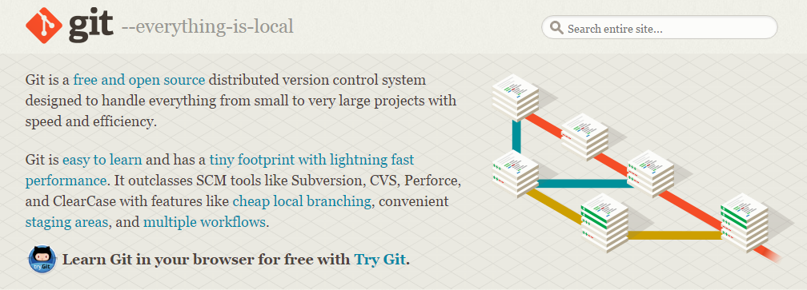

## 搭建开发环境

#### build-essential

我们首先要安装可能需要的编译环境及类库，这里我们直接使用apt提供的安装办法：

```
# apt install build-essential
```

#### Anaconda3

我们这里会用到数学计算的相关python库，比如numpy，matplotlib等，这里我们使用基于Python3.5的Anaconda3。

安装过程如下：

```
# ls
Anaconda3-4.2.0-Linux-x86_64.sh
# ./Anaconda3-4.2.0-Linux-x86_64.sh

Welcome to Anaconda3 4.2.0 (by Continuum Analytics, Inc.)

In order to continue the installation process, please review the license
agreement.
Please, press ENTER to continue
>>>
================
Anaconda License
================

Copyright 2016, Continuum Analytics, Inc.

All rights reserved under the 3-clause BSD License:

Redistribution and use in source and binary forms, with or without
modification, are permitted provided that the following conditions are met:

* Redistributions of source code must retain the above copyright notice,
this list of conditions and the following disclaimer.

* Redistributions in binary form must reproduce the above copyright notice,
this list of conditions and the following disclaimer in the documentation
and/or other materials provided with the distribution.

* Neither the name of Continuum Analytics, Inc. nor the names of its
contributors may be used to endorse or promote products derived from this
software without specific prior written permission.

THIS SOFTWARE IS PROVIDED BY THE COPYRIGHT HOLDERS AND CONTRIBUTORS "AS IS"
AND ANY EXPRESS OR IMPLIED WARRANTIES, INCLUDING, BUT NOT LIMITED TO, THE
IMPLIED WARRANTIES OF MERCHANTABILITY AND FITNESS FOR A PARTICULAR PURPOSE
ARE DISCLAIMED. IN NO EVENT SHALL CONTINUUM ANALYTICS, INC. BE LIABLE FOR
ANY DIRECT, INDIRECT, INCIDENTAL, SPECIAL, EXEMPLARY, OR CONSEQUENTIAL
DAMAGES (INCLUDING, BUT NOT LIMITED TO, PROCUREMENT OF SUBSTITUTE GOODS OR
SERVICES; LOSS OF USE, DATA, OR PROFITS; OR BUSINESS INTERRUPTION) HOWEVER
CAUSED AND ON ANY THEORY OF LIABILITY, WHETHER IN CONTRACT, STRICT
LIABILITY, OR TORT (INCLUDING NEGLIGENCE OR OTHERWISE) ARISING IN ANY WAY
OUT OF THE USE OF THIS SOFTWARE, EVEN IF ADVISED OF THE POSSIBILITY OF SUCH
DAMAGE.


Notice of Third Party Software Licenses
=======================================

Anaconda contains open source software packages from third parties. These
are available on an "as is" basis and subject to their individual license
agreements. These licenses are available in Anaconda or at
http://docs.continuum.io/anaconda/pkg-docs . Any binary packages of these
third party tools you obtain via Anaconda are subject to their individual
licenses as well as the Anaconda license. Continuum reserves the right to
change which third party tools are provided in Anaconda.

In particular, Anaconda contains re-distributable, run-time, shared-library
files from the Intel (TM) Math Kernel Library ("MKL binaries").  You are
specifically authorized to use the MKL binaries with your installation of
Anaconda.  You are also authorized to redistribute the MKL binaries with
Anaconda or in the conda package that contains them.  If needed,
instructions for removing the MKL binaries after installation of Anaconda
are available at http://www.continuum.io.

Cryptography Notice
===================
This distribution includes cryptographic software. The country in which you
currently reside may have restrictions on the import, possession, use,
and/or re-export to another country, of encryption software. BEFORE using
any encryption software, please check your country's laws, regulations and
policies concerning the import, possession, or use, and re-export of
encryption software, to see if this is permitted. See the Wassenaar
Arrangement <http://www.wassenaar.org/> for more information.

Continuum Analytics has self-classified this software as Export Commodity
Control Number (ECCN) 5D002.C.1, which includes information security
software using or performing cryptographic functions with asymmetric
algorithms. The form and manner of this distribution makes it eligible for
export under the License Exception ENC Technology Software Unrestricted
(TSU) exception (see the BIS Export Administration Regulations, Section
740.13) for both object code and source code.

The following packages are included in this distribution that relate to
cryptography:

openssl
The OpenSSL Project is a collaborative effort to develop a robust,
commercial-grade, full-featured, and Open Source toolkit implementing the
Transport Layer Security (TLS) and Secure Sockets Layer (SSL) protocols as
well as a full-strength general purpose cryptography library.

pycrypto
A collection of both secure hash functions (such as SHA256 and RIPEMD160),
and various encryption algorithms (AES, DES, RSA, ElGamal, etc.).

pyopenssl
A thin Python wrapper around (a subset of) the OpenSSL library.

kerberos (krb5, non-Windows platforms)
A network authentication protocol designed to provide strong authentication
for client/server applications by using secret-key cryptography.

cryptography
A Python library which exposes cryptographic recipes and primitives.

Do you approve the license terms? [yes|no]
>>> yes

Anaconda3 will now be installed into this location:
/home/yonghui/anaconda3

  - Press ENTER to confirm the location
  - Press CTRL-C to abort the installation
  - Or specify a different location below

  [/home/yonghui/anaconda3] >>>
  PREFIX=/home/yonghui/anaconda3
  installing: python-3.5.2-0 ...
  installing: _license-1.1-py35_1 ...
  installing: _nb_ext_conf-0.3.0-py35_0 ...
  installing: alabaster-0.7.9-py35_0 ...
  installing: anaconda-clean-1.0.0-py35_0 ...
  installing: anaconda-client-1.5.1-py35_0 ...
  installing: anaconda-navigator-1.3.1-py35_0 ...
  installing: argcomplete-1.0.0-py35_1 ...
  installing: astroid-1.4.7-py35_0 ...
  installing: astropy-1.2.1-np111py35_0 ...
  installing: babel-2.3.4-py35_0 ...
  installing: backports-1.0-py35_0 ...
  installing: beautifulsoup4-4.5.1-py35_0 ...
  installing: bitarray-0.8.1-py35_0 ...
  installing: blaze-0.10.1-py35_0 ...
  installing: bokeh-0.12.2-py35_0 ...
  installing: boto-2.42.0-py35_0 ...
  installing: bottleneck-1.1.0-np111py35_0 ...
  installing: cairo-1.12.18-6 ...
  installing: cffi-1.7.0-py35_0 ...
  installing: chest-0.2.3-py35_0 ...
  installing: click-6.6-py35_0 ...
  installing: cloudpickle-0.2.1-py35_0 ...
  installing: clyent-1.2.2-py35_0 ...
  installing: colorama-0.3.7-py35_0 ...
  installing: configobj-5.0.6-py35_0 ...
  installing: contextlib2-0.5.3-py35_0 ...
  installing: cryptography-1.5-py35_0 ...
  installing: curl-7.49.0-1 ...
  installing: cycler-0.10.0-py35_0 ...
  installing: cython-0.24.1-py35_0 ...
  installing: cytoolz-0.8.0-py35_0 ...
  installing: dask-0.11.0-py35_0 ...
  installing: datashape-0.5.2-py35_0 ...
  installing: dbus-1.10.10-0 ...
  installing: decorator-4.0.10-py35_0 ...
  installing: dill-0.2.5-py35_0 ...
  installing: docutils-0.12-py35_2 ...
  installing: dynd-python-0.7.2-py35_0 ...
  installing: entrypoints-0.2.2-py35_0 ...
  installing: et_xmlfile-1.0.1-py35_0 ...
  installing: expat-2.1.0-0 ...
  installing: fastcache-1.0.2-py35_1 ...
  installing: filelock-2.0.6-py35_0 ...
  installing: flask-0.11.1-py35_0 ...
  installing: flask-cors-2.1.2-py35_0 ...
  installing: fontconfig-2.11.1-6 ...
  installing: freetype-2.5.5-1 ...
  installing: get_terminal_size-1.0.0-py35_0 ...
  installing: gevent-1.1.2-py35_0 ...
  installing: glib-2.43.0-1 ...
  installing: greenlet-0.4.10-py35_0 ...
  installing: gst-plugins-base-1.8.0-0 ...
  installing: gstreamer-1.8.0-0 ...
  installing: h5py-2.6.0-np111py35_2 ...
  installing: harfbuzz-0.9.39-1 ...
  installing: hdf5-1.8.17-1 ...
  installing: heapdict-1.0.0-py35_1 ...
  installing: icu-54.1-0 ...
  installing: idna-2.1-py35_0 ...
  installing: imagesize-0.7.1-py35_0 ...
  installing: ipykernel-4.5.0-py35_0 ...
  installing: ipython-5.1.0-py35_0 ...
  installing: ipython_genutils-0.1.0-py35_0 ...
  installing: ipywidgets-5.2.2-py35_0 ...
  installing: itsdangerous-0.24-py35_0 ...
  installing: jbig-2.1-0 ...
  installing: jdcal-1.2-py35_1 ...
  installing: jedi-0.9.0-py35_1 ...
  installing: jinja2-2.8-py35_1 ...
  installing: jpeg-8d-2 ...
  installing: jsonschema-2.5.1-py35_0 ...
  installing: jupyter-1.0.0-py35_3 ...
  installing: jupyter_client-4.4.0-py35_0 ...
  installing: jupyter_console-5.0.0-py35_0 ...
  installing: jupyter_core-4.2.0-py35_0 ...
  installing: lazy-object-proxy-1.2.1-py35_0 ...
  installing: libdynd-0.7.2-0 ...
  installing: libffi-3.2.1-0 ...
  installing: libgcc-4.8.5-2 ...
  installing: libgfortran-3.0.0-1 ...
  installing: libpng-1.6.22-0 ...
  installing: libsodium-1.0.10-0 ...
  installing: libtiff-4.0.6-2 ...
  installing: libxcb-1.12-0 ...
  installing: libxml2-2.9.2-0 ...
  installing: libxslt-1.1.28-0 ...
  installing: llvmlite-0.13.0-py35_0 ...
  installing: locket-0.2.0-py35_1 ...
  installing: lxml-3.6.4-py35_0 ...
  installing: markupsafe-0.23-py35_2 ...
  installing: matplotlib-1.5.3-np111py35_0 ...
  installing: mistune-0.7.3-py35_0 ...
  installing: mkl-11.3.3-0 ...
  installing: mkl-service-1.1.2-py35_2 ...
  installing: mpmath-0.19-py35_1 ...
  installing: multipledispatch-0.4.8-py35_0 ...
  installing: nb_anacondacloud-1.2.0-py35_0 ...
  installing: nb_conda-2.0.0-py35_0 ...
  installing: nb_conda_kernels-2.0.0-py35_0 ...
  installing: nbconvert-4.2.0-py35_0 ...
  installing: nbformat-4.1.0-py35_0 ...
  installing: nbpresent-3.0.2-py35_0 ...
  installing: networkx-1.11-py35_0 ...
  installing: nltk-3.2.1-py35_0 ...
  installing: nose-1.3.7-py35_1 ...
  installing: notebook-4.2.3-py35_0 ...
  installing: numba-0.28.1-np111py35_0 ...
  installing: numexpr-2.6.1-np111py35_0 ...
  installing: numpy-1.11.1-py35_0 ...
  installing: odo-0.5.0-py35_1 ...
  installing: openpyxl-2.3.2-py35_0 ...
  installing: openssl-1.0.2j-0 ...
  installing: pandas-0.18.1-np111py35_0 ...
  installing: partd-0.3.6-py35_0 ...
  installing: patchelf-0.9-0 ...
  installing: path.py-8.2.1-py35_0 ...
  installing: pathlib2-2.1.0-py35_0 ...
  installing: patsy-0.4.1-py35_0 ...
  installing: pep8-1.7.0-py35_0 ...
  installing: pexpect-4.0.1-py35_0 ...
  installing: pickleshare-0.7.4-py35_0 ...
  installing: pillow-3.3.1-py35_0 ...
  installing: pip-8.1.2-py35_0 ...
  installing: pixman-0.32.6-0 ...
  installing: pkginfo-1.3.2-py35_0 ...
  installing: ply-3.9-py35_0 ...
  installing: prompt_toolkit-1.0.3-py35_0 ...
  installing: psutil-4.3.1-py35_0 ...
  installing: ptyprocess-0.5.1-py35_0 ...
  installing: py-1.4.31-py35_0 ...
  installing: pyasn1-0.1.9-py35_0 ...
  installing: pycosat-0.6.1-py35_1 ...
  installing: pycparser-2.14-py35_1 ...
  installing: pycrypto-2.6.1-py35_4 ...
  installing: pycurl-7.43.0-py35_0 ...
  installing: pyflakes-1.3.0-py35_0 ...
  installing: pygments-2.1.3-py35_0 ...
  installing: pylint-1.5.4-py35_1 ...
  installing: pyopenssl-16.0.0-py35_0 ...
  installing: pyparsing-2.1.4-py35_0 ...
  installing: pyqt-5.6.0-py35_0 ...
  installing: pytables-3.2.3.1-np111py35_0 ...
  installing: pytest-2.9.2-py35_0 ...
  installing: python-dateutil-2.5.3-py35_0 ...
  installing: pytz-2016.6.1-py35_0 ...
  installing: pyyaml-3.12-py35_0 ...
  installing: pyzmq-15.4.0-py35_0 ...
  installing: qt-5.6.0-0 ...
  installing: qtawesome-0.3.3-py35_0 ...
  installing: qtconsole-4.2.1-py35_1 ...
  installing: qtpy-1.1.2-py35_0 ...
  installing: readline-6.2-2 ...
  installing: redis-3.2.0-0 ...
  installing: redis-py-2.10.5-py35_0 ...
  installing: requests-2.11.1-py35_0 ...
  installing: rope-0.9.4-py35_1 ...
  installing: scikit-image-0.12.3-np111py35_1 ...
  installing: scikit-learn-0.17.1-np111py35_2 ...
  installing: scipy-0.18.1-np111py35_0 ...
  installing: setuptools-27.2.0-py35_0 ...
  installing: simplegeneric-0.8.1-py35_1 ...
  installing: singledispatch-3.4.0.3-py35_0 ...
  installing: sip-4.18-py35_0 ...
  installing: six-1.10.0-py35_0 ...
  installing: snowballstemmer-1.2.1-py35_0 ...
  installing: sockjs-tornado-1.0.3-py35_0 ...
  installing: sphinx-1.4.6-py35_0 ...
  installing: spyder-3.0.0-py35_0 ...
  installing: sqlalchemy-1.0.13-py35_0 ...
  installing: sqlite-3.13.0-0 ...
  installing: statsmodels-0.6.1-np111py35_1 ...
  installing: sympy-1.0-py35_0 ...
  installing: terminado-0.6-py35_0 ...
  installing: tk-8.5.18-0 ...
  installing: toolz-0.8.0-py35_0 ...
  installing: tornado-4.4.1-py35_0 ...
  installing: traitlets-4.3.0-py35_0 ...
  installing: unicodecsv-0.14.1-py35_0 ...
  installing: wcwidth-0.1.7-py35_0 ...
  installing: werkzeug-0.11.11-py35_0 ...
  installing: wheel-0.29.0-py35_0 ...
  installing: widgetsnbextension-1.2.6-py35_0 ...
  installing: wrapt-1.10.6-py35_0 ...
  installing: xlrd-1.0.0-py35_0 ...
  installing: xlsxwriter-0.9.3-py35_0 ...
  installing: xlwt-1.1.2-py35_0 ...
  installing: xz-5.2.2-0 ...
  installing: yaml-0.1.6-0 ...
  installing: zeromq-4.1.4-0 ...
  installing: zlib-1.2.8-3 ...
  installing: anaconda-4.2.0-np111py35_0 ...
  installing: ruamel_yaml-0.11.14-py35_0 ...
  installing: conda-4.2.9-py35_0 ...
  installing: conda-build-2.0.2-py35_0 ...
  Python 3.5.2 :: Continuum Analytics, Inc.
  creating default environment...
  installation finished.
  Do you wish the installer to prepend the Anaconda3 install location
  to PATH in your /home/yonghui/.bashrc ? [yes|no]
  [no] >>> yes

  Prepending PATH=/home/yonghui/anaconda3/bin to PATH in /home/yonghui/.bashrc
  A backup will be made to: /home/yonghui/.bashrc-anaconda3.bak


  For this change to become active, you have to open a new terminal.

  Thank you for installing Anaconda3!

  Share your notebooks and packages on Anaconda Cloud!
  Sign up for free: https://anaconda.org

```

### fortran

由于我们的部分功能由fortran实现，因此我们需要安装一个fortran的编译器，这里我们选用的为gfortran。它的安装十分方便：

```
# apt install gfortran
```
### git

Git是一款免费、开源的分布式版本控制系统，用于敏捷高效地处理任何或小或大的项目。



Git是一个开源的分布式版本控制系统，可以有效、高速的处理从很小到非常大的项目版本管理。Git 是 Linus Torvalds 为了帮助管理 Linux 内核开发而开发的一个开放源码的版本控制软件。

Torvalds 开始着手开发 Git 是为了作为一种过渡方案来替代 BitKeeper，后者之前一直是 Linux 内核开发人员在全球使用的主要源代码工具。开放源码社区中的有些人觉得BitKeeper 的许可证并不适合开放源码社区的工作，因此 Torvalds 决定着手研究许可证更为灵活的版本控制系统。尽管最初 Git 的开发是为了辅助 Linux 内核开发的过程，但是我们已经发现在很多其他自由软件项目中也使用了 Git。例如 很多 Freedesktop 的项目迁移到了 Git 上。

linux上安装git比较方便

```
# apt install git
# git config --global user.name "zyoohv"
# git config --global user.email zyoohv@gmail.com
```

### cmake

CMake是一个跨平台的安装（编译）工具，可以用简单的语句来描述所有平台的安装(编译过程)。他能够输出各种各样的makefile或者project文件，能测试编译器所支持的C++特性,类似UNIX下的automake。只是 CMake 的组态档取名为 CMakeLists.txt。Cmake 并不直接建构出最终的软件，而是产生标准的建构档（如 Unix 的 Makefile 或 Windows Visual C++ 的 projects/workspaces），然后再依一般的建构方式使用。这使得熟悉某个集成开发环境（IDE）的开发者可以用标准的方式建构他的软件，这种可以使用各平台的原生建构系统的能力是 CMake 和 SCons 等其他类似系统的区别之处。

在Linux下安装cmake的代码如下：

```
# apt install cmake
```
