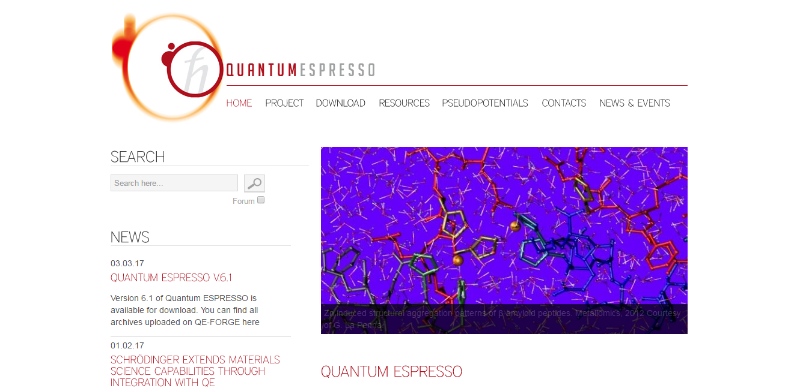
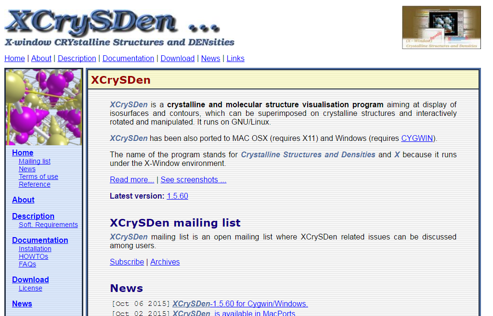
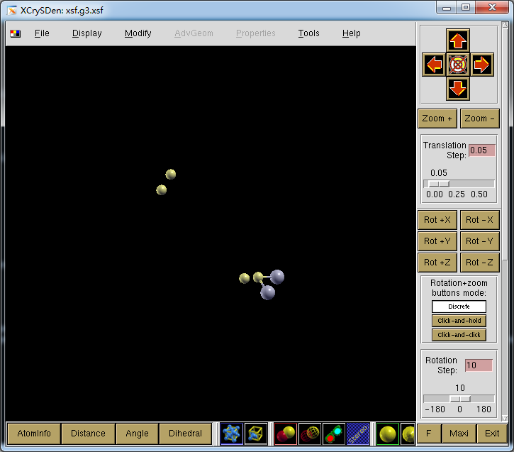

## 安装相关软件

### pwscf

`pwscf`现改名为`Quantum ESPRESSO`，我们需要从官网下载源码进行安装。



```
# tar -zxvf qe-6.1.tar.gz
# cd qe-6.1/
# ./configure
# make all -j4
```

### xcrysden

xcrysden为我们提供了一个可以直观的观察原子分布的方法。



我们选用xcrysden-1.5.60-linux_x86_64-semishared.tar.gz文件进行解压即可。

```
# tar -zxvf xcrysden-1.5.60-linux_x86_64-semishared.tar.gz
```


