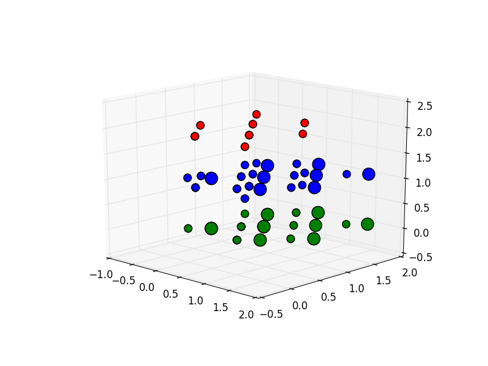

## 聚类

### scikit-learn

自2007年发布以来，scikit-learn已经成为Python重要的机器学习库了。scikit-learn简称sklearn，支持包括分类、回归、降维和聚类四大机器学习算法。还包含了特征提取、数据处理和模型评估三大模块。

sklearn是Scipy的扩展，建立在NumPy和matplotlib库的基础上。利用这几大模块的优势，可以大大提高机器学习的效率。

sklearn拥有着完善的文档，上手容易，具有着丰富的API，在学术界颇受欢迎。sklearn已经封装了大量的机器学习算法，包括LIBSVM和LIBINEAR。同时sklearn内置了大量数据集，节省了获取和整理数据集的时间。


### 安装sklearn

由于我们使用的Anaconda版本的Python，其已经自带sklearn库。如果使用其他版本的Python，或者需要更新sklearn版本，可使用python-pip管理工具进行安装。

```
# pip install sklearn
```

### 准备阶段-设计模式

为了方便拓展及维护，我们首先定义了一个公共父类，用来实现所有算法都需要的数据预处理、画图、数据增强等功能，我们稍后会详细的讲解这几个功能的实现方法。

我们的父类的核心代码如下：

```Python
class clusterNormal(object):
    """docstring for cluster
    """

    def __init__(self, axis, atom, posi):
        """ for example:
        axis : [vec_a, vec_b, vec_c]
        atom : [[42], [16], [16]]
        posi : [x1, x2, ...]
        """
        ...

    def augAtoms(self):
      """augment dataset.
      """
        ...

    def paint2D(self):
      """draw 2D image.
      """
        ...

    def paint3D(self):
      """draw 3D image.
      """
        ...

    def selectAtom(self):
      """slect atoms which we want.
      """
        ...
```

### 实现算法接口

有了父类代码，我们就可以简单的继承父类，同时只要简单的实现我们的算法部分就可以了。

我们已经实现了DBSCAN, MeanShift, AffinityPropagation, KMeans等算法，如果实验人员有其他需要，只需按照如下写法，简单的继承并重写`run`方法即可。

```Python

class DBSCAN_method(clusterNormal):
    """docstring for DBSCAN_method"""
    def run(self):
      ...


class MeanShift_method(clusterNormal):
    """docstring for MeanShift_method"""
    def run(self):
      ...


class AffinityPropagation_method(clusterNormal):
    """docstring for AffinityPropagation_method"""
    def run(self):
      ...


class KMeans_method(clusterNormal):
    """docstring for KMeans_method"""
    def run(self):
      ...
```

### 实验结果

我们使用经典的Kmean++算法进行聚类，初始核心数量为3。

实验结果我们用不同的颜色表示不同的类别，如图片所示：





